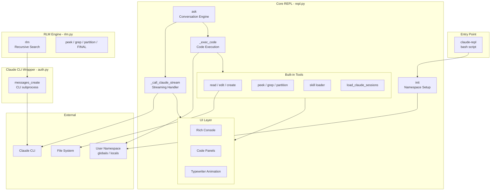
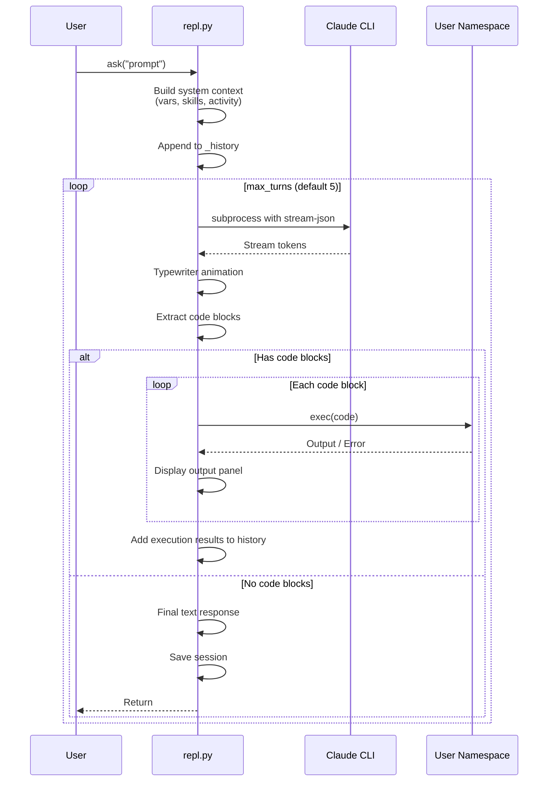
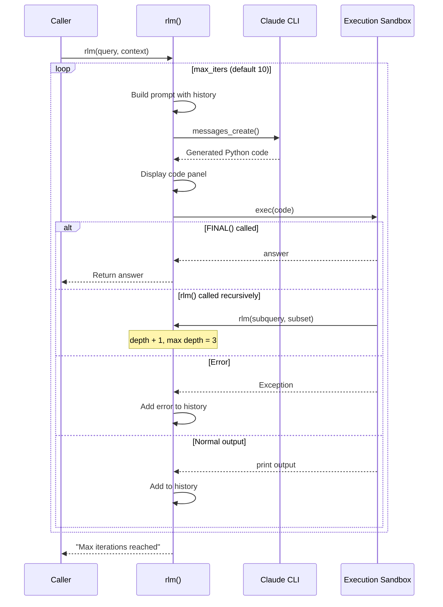
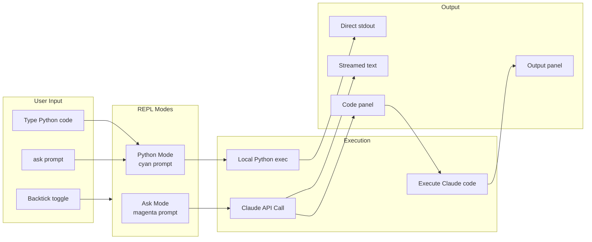

# System Architecture

## Project Overview

**mahtab** is an AI-powered shared Python REPL that integrates Claude AI for interactive programming assistance. The system creates a collaborative environment where Claude can execute code directly in the user's namespace, inspect variables, modify files, and explore large text contexts using recursive search strategies.

### Key Features

- **Shared Namespace**: Claude sees and modifies the same variables as the user
- **Streaming Responses**: Real-time typewriter animation with live code panel updates
- **Multi-turn Agentic Loop**: Claude can execute multiple code blocks per turn, iterating until complete
- **File Operations**: Read, edit, and create files with automatic module reloading
- **Text Exploration Tools**: `peek()`, `grep()`, `partition()` for navigating large data
- **Recursive LLM Search (RLM)**: Code-generating exploration algorithm for massive contexts
- **Skills System**: Extensible skill files in `~/.mahtab/skills/`
- **Session Persistence**: Last exchange saved for cross-session continuity
- **Usage Tracking**: Token counts and cost tracking per session

---

## Architecture Diagram



---

## Component Details

### 1. Entry Point - `claude-repl`

A minimal bash script that launches the interactive REPL:

```bash
#!/bin/bash
exec uv run python -i -m repl
```

Uses `uv` for dependency management and runs Python in interactive mode (`-i`) loading the `repl` module.

---

### 2. Main REPL Module - `repl.py`

The core 985-line module containing all primary functionality.

#### Namespace Management

```
_globals: dict    # Caller's global namespace
_locals: dict     # Caller's local namespace  
_history: list    # Conversation message history
_repl_activity: list  # Captured REPL input/output between ask() calls
```

The `init(globals(), locals())` function captures the caller's namespace, enabling Claude to see and modify user variables.

#### Conversation Engine - `ask()`

The main entry point for Claude interactions:

| Function | Purpose |
|----------|---------|
| `ask(prompt, max_turns=5)` | Send prompt to Claude, execute code blocks |
| `_ask_async()` | Async implementation with multi-turn loop |
| `_call_claude_stream()` | Subprocess Claude CLI with streaming JSON |
| `_summarize_namespace()` | Build context about available variables |

#### Code Execution - `_exec_code()`

Executes Claude-generated Python in the shared namespace:
- Tries `eval()` first (for expressions)
- Falls back to `exec()` (for statements)
- Output limited to 10,000 characters via `_LimitedOutput`
- Returns captured stdout or error message

#### File Operations

| Function | Description |
|----------|-------------|
| `read(path, start=1, end=None)` | Read file with line numbers |
| `edit(path, old, new)` | Replace text, auto-reload Python modules |
| `create(name, content="")` | Create new Python module with package support |
| `ed(content="", path=None)` | Open `$EDITOR` for text editing |

#### Text Exploration Tools

| Function | Description |
|----------|-------------|
| `peek(text, n=2000)` | Return first n characters |
| `grep(text, pattern)` | Return lines matching regex (case-insensitive) |
| `partition(text, n=10)` | Split into n roughly equal chunks |

#### Skills System

Skills are markdown files in `~/.mahtab/skills/` with optional YAML frontmatter:

```python
SKILLS_DIR = Path("~/.mahtab/skills").expanduser()

def skill(name, args="") -> str:
    # Load skill file, strip frontmatter, replace $ARGUMENTS
```

#### UI Layer

Rich library components for terminal output:
- `_print_code()` - Syntax-highlighted code panels
- `_print_output()` - Execution result panels
- Typewriter animation with `output_queue` and async drain
- Live-updating code panels during streaming

#### Modal REPL

Alternative interface with mode toggling:
- Backtick (`` ` ``) toggles between ask mode and python mode
- Cyan prompt for Python, magenta for ask mode
- Tab completion via readline

---

### 3. Claude CLI Wrapper - `auth.py`

Provides `messages_create()` to wrap the Claude CLI:

```python
def messages_create(
    model: str,
    max_tokens: int,
    system: str,
    messages: list[dict],
    on_token: callable = None,
) -> dict
```

**CLI Invocation:**
```bash
claude -p <prompt> \
    --model <model> \
    --system-prompt <system> \
    --setting-sources "" \
    --output-format stream-json \
    --include-partial-messages
```

**Stream Processing:**
- Parses `stream_event` with `content_block_delta` for tokens
- Calls `on_token(text)` callback for live UI updates
- Extracts final result from `type: "result"` event

---

### 4. Recursive LLM Search - `rlm.py`

Implements the RLM algorithm where the LLM writes code to explore large contexts.

#### System Prompt

```
You explore data by writing Python code.

Tools:
  peek(n=2000) -> str              # First n chars of context
  grep(pattern) -> list[str]       # Lines matching regex
  partition(n=10) -> list[str]     # Split into n chunks
  rlm(query, subset) -> str        # Recursively explore subset
  FINAL(answer)                    # Return answer and stop
```

#### Algorithm Parameters

| Parameter | Default | Description |
|-----------|---------|-------------|
| `depth` | 0 | Current recursion depth |
| `max_depth` | 3 | Maximum recursion depth |
| `max_iters` | 10 | Max iterations per depth level |

#### Execution Sandbox

Code runs in a restricted namespace:
```python
local_vars = {
    "context": context,
    "peek": peek,
    "grep": grep,
    "partition": partition,
    "rlm": recurse,
    "FINAL": FINAL,
    "print": capture_print,
    "re": re,
    "len": len,
}
exec(code, {"__builtins__": {}}, local_vars)
```

---

## Data Flow Diagram

### Main Conversation Flow



### RLM Recursive Flow



---

## REPL Interaction Flow



---

## File Structure

```
repl-ai/
├── claude-repl           # Entry point bash script
├── repl.py               # Main REPL module (985 lines)
│   ├── Namespace management
│   ├── ask() conversation engine
│   ├── _exec_code() execution
│   ├── File operations (read/edit/create)
│   ├── Text tools (peek/grep/partition)
│   ├── Skills loader
│   ├── ModalREPL class
│   └── UI components
├── auth.py               # Claude CLI wrapper (98 lines)
│   └── messages_create()
├── rlm.py                # Recursive LLM search (183 lines)
│   └── rlm() algorithm
├── pyproject.toml        # Project configuration
├── uv.lock               # Dependency lock file
└── .pre-commit-config.yaml
```

### User Data Directories

```
~/.mahtab/
├── skills/               # Skill markdown files
│   └── *.md
└── last_session.json     # Cross-session context
```

---

## Dependencies

### Runtime Dependencies

| Package | Purpose |
|---------|---------|
| `anthropic` | Anthropic API types (not directly used for calls) |
| `rich` | Terminal UI (panels, syntax highlighting, spinners) |
| `langchain` | LangChain framework |
| `langgraph` | LangGraph for agent workflows |

### Development Dependencies

| Package | Purpose |
|---------|---------|
| `ruff` | Linting and formatting |
| `pre-commit` | Git hooks |

### External Tools

| Tool | Purpose |
|------|---------|
| `claude` CLI | Anthropic's Claude Code CLI for API calls |
| `uv` | Python package/project manager |
| `$EDITOR` | External editor for `ed()` function |

---

## Key Design Patterns

### 1. Subprocess-based API Calls

Instead of using the Anthropic Python SDK directly, the system shells out to the `claude` CLI:
- Avoids SDK version dependencies
- Leverages Claude Code's built-in streaming
- Uses `--output-format stream-json` for structured parsing

### 2. Shared Namespace Execution

Claude's code runs in the user's actual namespace:
```python
exec(code, _globals, _locals)
```
This enables true collaboration where Claude can inspect and modify the same objects the user is working with.

### 3. Output Limiting

Both main REPL and RLM limit output to prevent context explosion:
```python
class _LimitedOutput:
    def __init__(self, limit: int = 10000):
        # Raises RuntimeError if exceeded
```

### 4. Multi-turn Agentic Loop

The `ask()` function implements an agentic pattern:
1. Send prompt to Claude
2. If response contains code blocks, execute them
3. Feed execution results back to Claude
4. Repeat until Claude responds with just text (no code)
5. Maximum `max_turns` iterations (default 5)

### 5. Recursive Exploration (RLM)

For exploring massive contexts (e.g., all Claude session logs):
1. LLM generates exploration code
2. Code uses `peek()`, `grep()`, `partition()` to navigate
3. Can recursively call `rlm()` on subsets
4. `FINAL(answer)` terminates with result
5. Max depth prevents infinite recursion

---

## Usage Statistics Tracking

Session-level metrics tracked in `_usage_stats`:

```python
_usage_stats = {
    "total_cost_usd": 0.0,
    "input_tokens": 0,
    "output_tokens": 0,
    "cache_read_input_tokens": 0,
    "cache_creation_input_tokens": 0,
    "num_calls": 0,
}
```

View with `usage()` function.

---

## Security Considerations

1. **Code Execution**: Claude-generated code runs with full access to the user's namespace and file system
2. **RLM Sandbox**: Uses `{"__builtins__": {}}` to restrict available functions, but still has file system access via the tools
3. **No Network Restrictions**: Code can make network calls
4. **Session Persistence**: Last exchange stored in plaintext at `~/.mahtab/last_session.json`

This is designed as a personal development tool, not for untrusted input.
